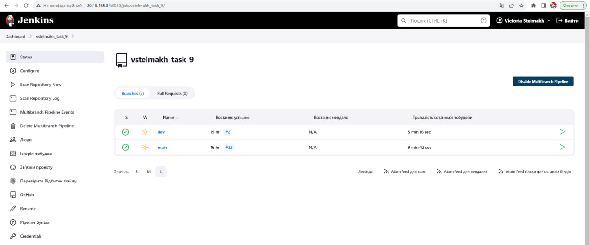
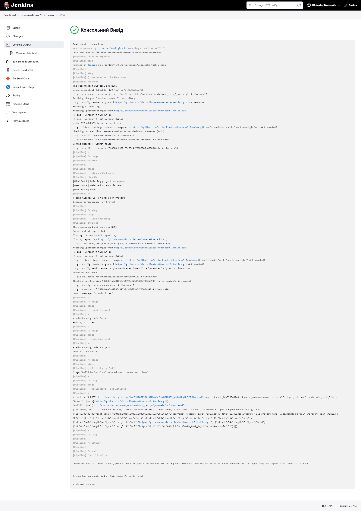
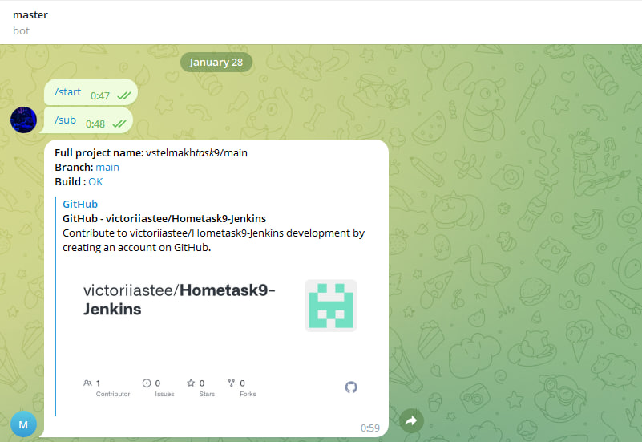

# Hometask9-Jenkins

To complete this task I:
- Created Azure instance with and installed Jenkins on it via [terraform script](azure-instance.tf);
- Installed necessary plugins and created jenkins user;
- Created multibranch pipeline using [Jenkinsfile](Jenkinsfile) and Github (including Github Webhooks); 

- Added Telegram Bot plugin to Jenkins;
- Created and configured [telegram bot](https://t.me/super_dungeon_master_bot);
- Executed Jenkins job. 

 
Finally, I've got a notification in telegram bot.
 

Thank You!

